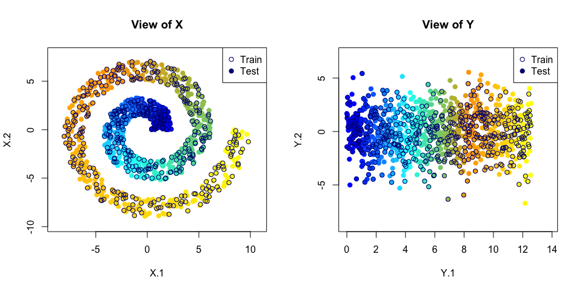
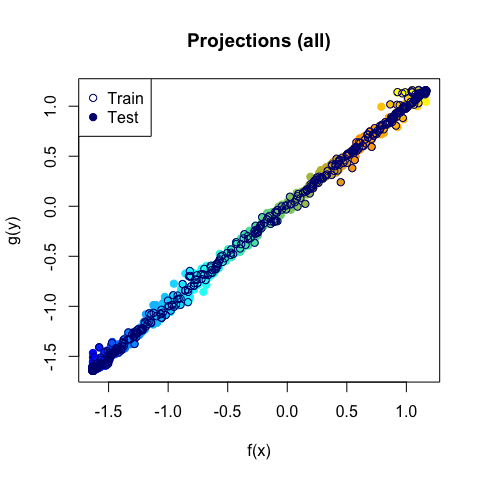

We try the demo in R. Here is the visualization of input data **X** and **Y**.



We run Run nonparametric CCA.

``` r
source("~/Documents/research/rdc/RDCnet/R/ncca.R")
ncca_res <- ncca(X[PairedIndices,],Y[PairedIndices,],
                 X[UnpairedIndices,],Y[UnpairedIndices,],
                 d = 2, hx = 0.75, hy = 0.75, nx = NumNNs_X, ny=NumNNs_Y)
```

    ## Normalizing S to be doubly stochastic ...
    ## 
      |                                                                       
      |                                                                 |   0%
      |                                                                       
      |====                                                             |   7%
      |                                                                       
      |=========                                                        |  13%
      |                                                                       
      |=============                                                    |  20%
      |                                                                       
      |=================                                                |  27%
      |                                                                       
      |======================                                           |  33%
      |                                                                       
      |==========================                                       |  40%
      |                                                                       
      |==============================                                   |  47%
      |                                                                       
      |===================================                              |  53%
      |                                                                       
      |=======================================                          |  60%
      |                                                                       
      |===========================================                      |  67%
      |                                                                       
      |================================================                 |  73%
      |                                                                       
      |====================================================             |  80%
      |                                                                       
      |========================================================         |  87%
      |                                                                       
      |=============================================================    |  93%
      |                                                                       
      |=================================================================| 100%
    ## Performing exact SVD ...

``` r
X_proj_paired <- ncca_res$X_new
Y_proj_paired <- ncca_res$Y_new
X_proj_unpaired <- ncca_res$XV_new
Y_proj_unpaired <- ncca_res$YV_new

## Visualize the results

plot(c(X_proj_paired[,1], X_proj_unpaired[,1]),
     c(Y_proj_paired[,1], Y_proj_unpaired[,1]), 
     col = col_b2y(N)[c(PairedIndices, UnpairedIndices)],
     pch = 19, xlab = "f(x)", ylab = "g(y)", main = "Projections (all)")
points(X_proj_paired[,1], Y_proj_paired[,1], col = "navy")
legend("topleft", c("Train", "Test"), pch = c(1, 19), col = "navy")
```



``` r
cat("The nonparametric canonical correlation between X and Y is ", ncca_res$cor_XY, "\n")
```

    ## The nonparametric canonical correlation between X and Y is  0.9991778 0.9965304
